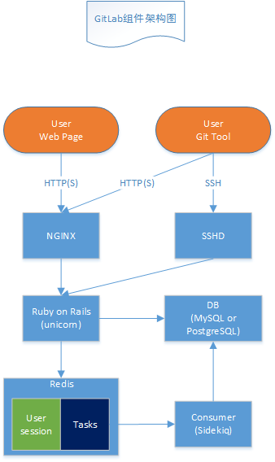

1.1.1 GitLab - 簡介

### 1. 简介
GitLab 是一个用于仓库管理系统的开源项目。使用Git作为代码管理工具，并在此基础上搭建起来的web服务。

Github是公共的git仓库，而Gitlab适合于搭建企业内部私有git仓库

提供了：

* 代码托管服务
* 访问权限控制
* 问题跟踪，bug的记录、跟踪和讨论
* Wiki，项目中一些相关的说明和文档
* 代码审查，可以查看、评论代码

### 2. 架构

]

### 3. 组件

* 前端：Nginx，用于页面及Git tool走http或https协议
* 后端：Gitlab服务，采用Ruby on Rails框架，通过unicorn实现后台服务及多进程
* SSHD：开启sshd服务，用于用户上传ssh key进行版本克隆及上传。注：用户上传的ssh key是保存到git账户中
* 数据库：目前仅支持MySQL和PostgreSQL
* Redis：用于存储用户session和任务，任务包括新建仓库、发送邮件等等
* Sidekiq：Rails框架自带的，订阅redis中的任务并执行
