### 1. Gitlab 管理使用手册

#### 1.1 创建项目所在的组--Group

##### 1.1.1 新建项目前，先创建项目所在的组（也就是说这个项目文件是保存在哪个组里）

选择Admin area

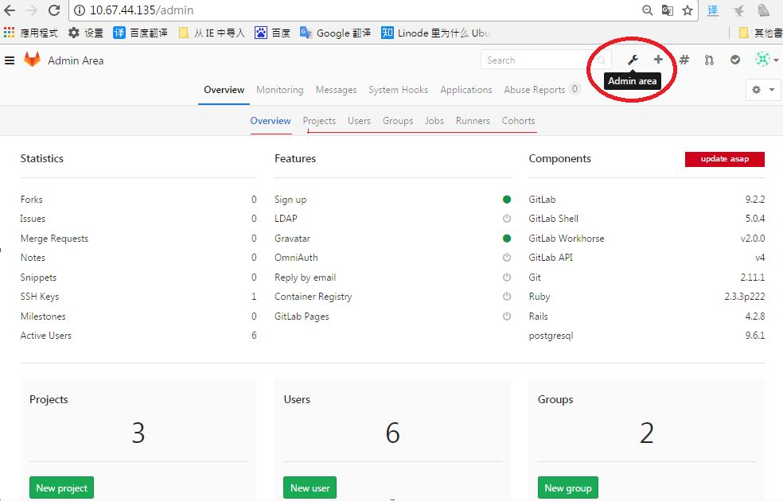

##### 1.1.2 选择Groups——New Group

##### 1.1.3 输入组名与相关信息

Group 有三种级别，分别是 Private、 Internal、 Public
Group 可选限制大文件存储，未选将限制上传文件最大 100M

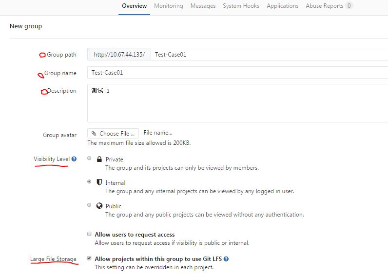

##### 1.1.4 Group 权限管理

用户权限：

1. 要有帐号[见1.3]；
2. 帐号要加入 Group [见 1.1.4];
3. 需将帐号的公钥加载到 Git [见 1.4]；
4. 有帐号独有 token(通过程式使用帐号时)[见 1.5]

设定 Group 下有那些 Project， Project 继承 Group 的 Memubers 权限

* 直接新建 Group 下的 Project-- New Project
* 移除 Group 下某 Project 项目。Project 仍然存在，不再继承此

Group 权限

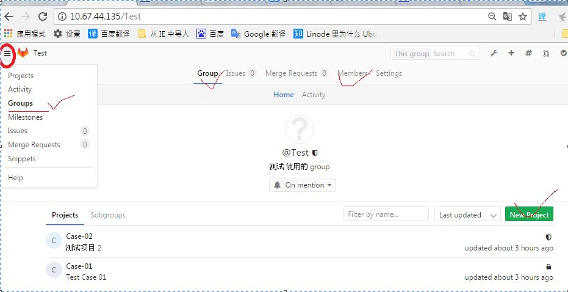

设定 Group 有那些 Memubers， 并在 role permissions 里设最大权限，详细见 Read more about role permissions

* 设定 Group 最大权限
* 变更 Memuber 权限类别
* 删除 Group 下某 Memuber 权限

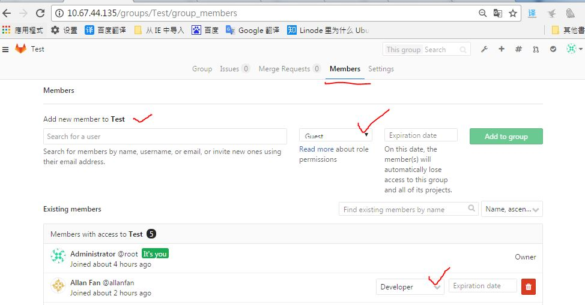

#### 1.2 新建项目--Project

1.2.1 选择 New Projcet

* Project 有三种级别，分别是 Private、 Internal、 Public
* 指定 Project path 选择 相应的 Group

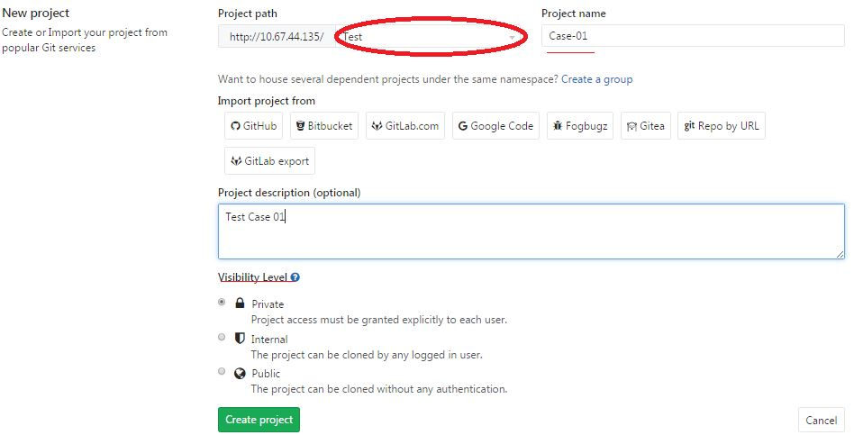

#### 1.3 新建用户帐号 -- User

1.3.1 选择 New User

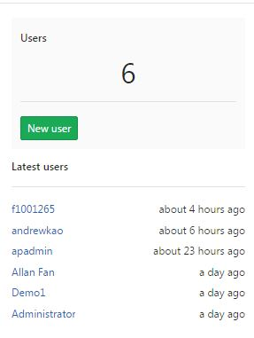

1.3.2 创建 user 账号，建议 Name 使用 公司工号

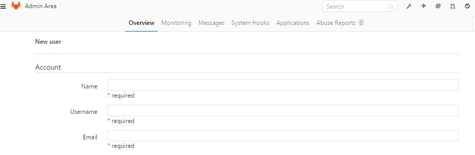

1.3.3 帐号密码

* 新创建账号，会通过 Mail 发密码激活连接给用户端， 第一次登录 Gitlab 后需要再将更新密码
* 要求密码循序公司密码原则

1.3.4 User Access

项目默认就好：

* Projects limit
* Can create group
* Access level

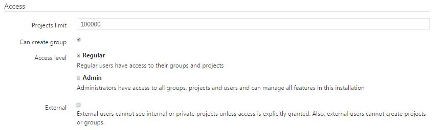

1.3.5 Profile

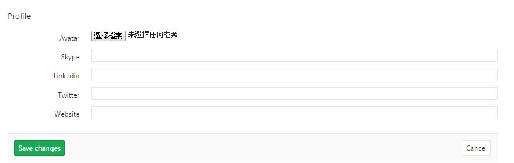

1.3.6 以上设定完成， 点击 Create User 完成创建工作

#### 1.4 添加用户公钥

登录》project setting》SSH,添加即可。 也只有添加公钥后，客户端才能连接 Gitlab

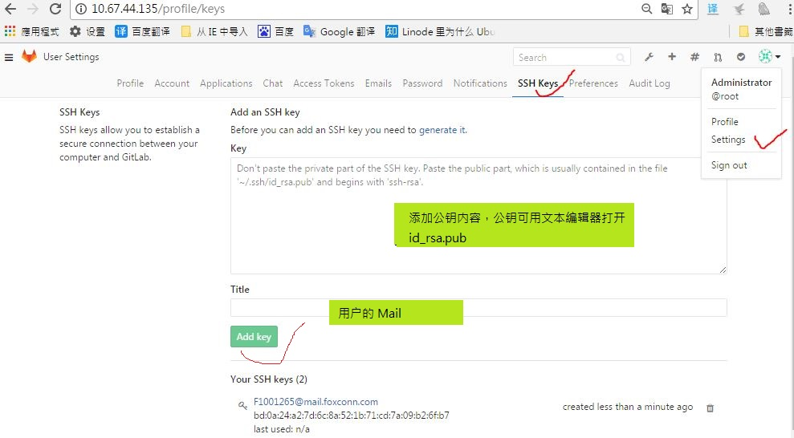

#### 1.5 生成 Private Token

用来代表用户身份的字符串，http 请求中包含这个就可以免输入用户名和密码，方便不同系统之间的代码提交等。比如 code review 系统使用这个 tocken 将 review 通过的请求提交到gitlab。tocken验证用户身份权限的

登录》Profile Settings 》 Access Account 可以看到帐号对应的 Token

或：admin Area --> users --> user account --> impersonation Tokens

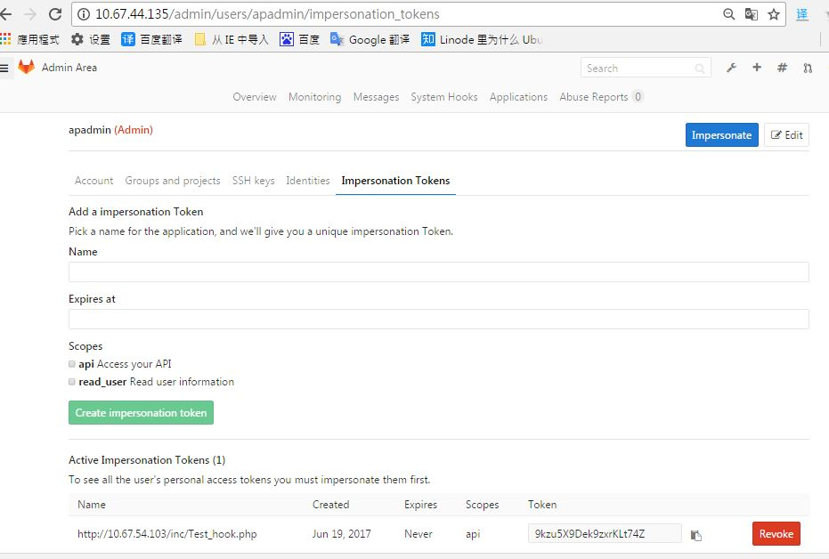

#### 2. Gitlab 用户使用手册

2.1 前提条件

Ｗindows 系统安装 git 客户端（1.产生 gitlab 服务端和本地 git 相互传输时所需要校验的私钥和公钥 2.直接在 Bash 中使用 git 提交和 push 代码，当然也可以用其他 可视化工具：sourcetree、TortoiseGit ）

    # 公网下载
    https://git-scm.com/downloads
    # 天津公盘
    \\10.67.50.93\tjfs\IT\TEMP\GIT

创建 gitlab 账号（一般公司配置 用自己的工号 + 邮箱）（1.建立远端分支，可追踪 2.本地和远端代码的修改活动详细显示 3.云储存库，储存代码 ）

一句话就是gitlab中存储着远端的代码; git是本地代码和远端代码沟通的桥梁，不过是用命令行的形式

2.2 客户端:

使用 git bash 命令生成 gitlab 服务端和本地 git 相互传输时所需要校验的私钥和公钥，公钥用于配置gitlab，私钥用户配置客户端。）

2.2.1 使用 git bash 生成公钥和私钥

设置 git 的 user name 和email,输入以下命令：

    git config --global user.name "test"
    git config --global user.email "test@gmail.com"

生成SSH密钥过程：
查看是否已经有了ssh密钥：

    $ cd ~/.ssh

无密钥回馈 bash: cd: /.ssh 目录： No such file or directory 。 如下图

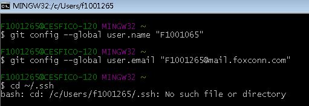

有密钥则可以进入 /.SSH 目录。 如下图

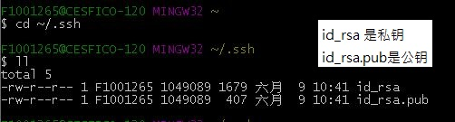

生成密钥：（注意ssh与参数之间没有空格！！！）

    $ ssh-keygen -t rsa -C “邮箱地址”
    //按3个回车，密码为空。

2.2.2 克隆远程仓库

前提：客户端生成密钥，且 Server 端在 gitlab 已认证用户公钥

从远程 Server克隆一个版本库到本地指定目录

    //git@10.67.44.135:test/case-01.git  是 Gitlab 中某 Project 的 SSH 或 Http
    $git clone git@10.67.44.135:test/case-01.git   

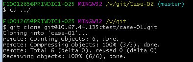

2.2.3 添加、查看远程库

    # 添加一个新的远程仓库, 用别名代表。后续向指定远程库作业，可使用此别名代表远程库
    git remote add <远程库别名> <远程库>

    // 查看当前关联的远程式库， 返回结果是: 远程库别名    远程库
    git remote -v                            

    //移除一个远程仓库在本地的影射
    git remote rm <远程库别名>

2.2.4 检查当前项目的 git 状态

    git status

2.2.5 创建和发布分支

一般为保证 Git 上主线代码的稳定，创建分支来管理开发或多版本控制

    // 创建本地分支
    git branch <分支名>

    // 查看分支
    git branch --all

    //将本地分支发布到 远程库
    git push origin <本地分支名>:<发布到远程库的分支名>

2.2.6 分支作业

    // 切换到<分支名> 分支进行开发
    $git checkout <分支名>

    //切换到主分支
    $git checkout master

    //把dev分支的更改和 master合并
    $git merge dev

    // 提交主分支代码远程
    $git push

    // 切换到dev远程分支
    $git checkout dev

    // 提交dev分支到远程
    $git push

*注意：在分支切换之前最好先commit全部的改变，除非你真的知道自己在做什么*

2.2.7 删除分支

    // 删除远程库里的 dev 分支， *危险命令哦*
    git push origin :dev

    // 切换到master分支
    git checkout master

    // 删除本地dev分
    git branch -d dev

2.2.8 提交修改文件,包括：添加，修改

    git add 文件名  

    // 当某文件类型被 Git 忽略时， -f 将强制添加该文件
    git add -f 文件名

    //完成了向本地仓库提交修改
    git commit –m “关于变更的描述”

    //推送到远程库对应分支上。只有當前分支變化，可以省參數
    git push

2.2.9 删除文件

    //删除文件跟踪并且删除仓库中的文件file1
    git rm file1

    //提交刚才的删除动作，之后git不再管理该文件。
    git commit

    //删除文件跟踪但不删除仓库的文件file1
    git rm --cached file1

    //提交刚才的删除动作，之后git不再管理该文件。但是文件系统中还是有file1。
    $git commit

2.2.10 从远程库获取新版本到本地

    //相当于是从远程获取最新版本到本地，不会自动merge
    git fetch

    //比较本地的master分支和origin/master分支的差别
    git log -p master..origin/master

    //如有差别，进行合并，本地与远程库统一版本
    git merge origin/master

    //相当于是从远程的origin的master主分支下获取最新版本
    //并merge到本地origin/master分支上,
    //其实相当于git fetch 和 git merge 整合
    git pull origin master                 

    //在实际使用中，git fetch更安全一些
    //因为在merge前，我们可以查看更新情况，然后再决定是否合并
